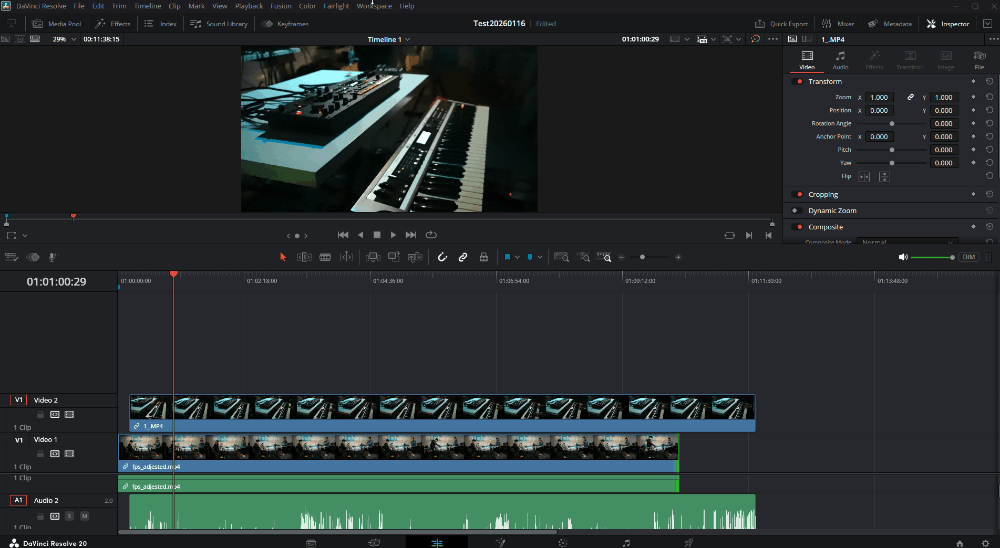

# DaVinci Resolve Random Video Switcher

A Python automation tool for DaVinci Resolve that splits video clips at regular intervals and randomly selects which clip to display at each segment. This creates a dynamic video switching effect across multiple video tracks.



## Table of Contents

- [Prerequisites & Installation](#prerequisites--installation)
- [Usage](#usage)
- [How it Works](#how-it-works)
- [Configuration](#configuration)
- [Limitations](#limitations)
- [Contributing](#contributing)
- [License](#license)

## Prerequisites & Installation

Tested with DaVinci Resolve 20.

For scripting environment setup, refer to the community documentation:
- [DaVinci Resolve Scripting API Documentation](https://extremraym.com/cloud/resolve-scripting-doc/) (unofficial, maintained by the community)

## Usage

1. Open DaVinci Resolve and load your project
2. Create a timeline with video clips on one or more video tracks
3. Select the timeline you want to process
4. Run the script using one of these methods:

### Method 1: Command Line

> **Warning:** Command line execution reportedly requires DaVinci Resolve **Studio** (paid version). **This method has NOT been tested by the author.**

```bash
python src/RandomVideoSwitcher.py
```

### Method 2: From DaVinci Resolve

Place both `src/RandomVideoSwitcher.py` and `src/python_get_resolve.py` in the same directory below, then access it via **Workspace** > **Scripts** menu:

| OS | All Users | Specific User |
|----|-----------|---------------|
| macOS | `/Library/Application Support/Blackmagic Design/DaVinci Resolve/Fusion/Scripts` | `~/Library/Application Support/Blackmagic Design/DaVinci Resolve/Fusion/Scripts` |
| Windows | `%PROGRAMDATA%\Blackmagic Design\DaVinci Resolve\Fusion\Scripts` | `%APPDATA%\Roaming\Blackmagic Design\DaVinci Resolve\Support\Fusion\Scripts` |
| Linux | `/opt/resolve/Fusion/Scripts` | `~/.local/share/DaVinciResolve/Fusion/Scripts` |

Use subfolders (`Edit`, `Color`, `Deliver`, `Utility`) to organize scripts by page.

## How it Works

The script performs the following steps:

### Step 1: Gather Information
- Connects to the running DaVinci Resolve instance
- Retrieves the current project and timeline
- Gets the timeline frame rate to calculate frame counts

### Step 2: Analyze Video Tracks
- Scans all video tracks in the timeline
- Collects clip information (start/end frames, source frames, media pool items)

### Step 3-4: Split Track 1
- Deletes original clips on video track 1
- Recreates clips split at the configured interval (default: 10 seconds)
- Each segment references the same source media with adjusted in/out points
- Records split points for use in subsequent tracks

### Step 5: Add Transitions (Skipped)
- Originally planned to add fade transitions (Cross Dissolve) to each clip
- Skipped because the DaVinci Resolve Scripting API does not support adding transitions

### Step 6: Split Other Tracks
- Applies the same split points from track 1 to all other video tracks
- Ensures all tracks are split at identical timeline positions

### Step 7: Random Selection
- Groups clips by their timeline start position
- For each group, randomly selects one clip to remain enabled
- Disables all other clips using `SetClipEnabled(False)`
- The result: at any given moment, only one randomly selected clip is visible

## Configuration

Edit the following variables at the top of `src/RandomVideoSwitcher.py`:

| Variable | Default | Description |
|----------|---------|-------------|
| `SPLIT_INTERVAL_SECONDS` | `10` | Interval in seconds at which clips are split |

## Limitations

- **Frame rate matching required** - The timeline frame rate in Project Settings must match the frame rate of your source media
- **Audio tracks are not modified** - The script only processes video tracks

## Contributing

Contributions are welcome! If you'd like to contribute:

1. Fork the repository
2. Create a feature branch (`git checkout -b feature/amazing-feature`)
3. Commit your changes (`git commit -m 'Add amazing feature'`)
4. Push to the branch (`git push origin feature/amazing-feature`)
5. Open a Pull Request

For bug reports or feature requests, please [open an issue](https://github.com/yourusername/davinci-resolve-random-video-switcher/issues).

## License

This project is licensed under the MIT License - see the [LICENSE](LICENSE) file for details.
